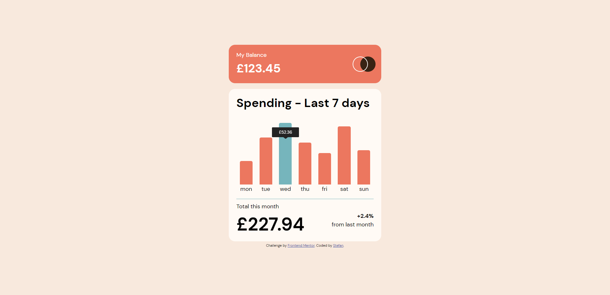

# Frontend Mentor - Expenses chart component solution

This is a solution to the [Expenses chart component challenge on Frontend Mentor](https://www.frontendmentor.io/challenges/expenses-chart-component-e7yJBUdjwt). Frontend Mentor challenges help you improve your coding skills by building realistic projects.

## Table of contents

- [Frontend Mentor - Expenses chart component solution](#frontend-mentor---expenses-chart-component-solution)
  - [Table of contents](#table-of-contents)
  - [Overview](#overview)
    - [The challenge](#the-challenge)
    - [Screenshot](#screenshot)
    - [Links](#links)
  - [My process](#my-process)
    - [Built with](#built-with)
    - [What I learned](#what-i-learned)
  - [Author](#author)

## Overview

### The challenge

Users should be able to:

- View the bar chart and hover over the individual bars to see the correct amounts for each day
- See the current day’s bar highlighted in a different colour to the other bars
- View the optimal layout for the content depending on their device’s screen size
- See hover states for all interactive elements on the page
- **Bonus**: Use the JSON data file provided to dynamically size the bars on the chart

### Screenshot

### Links

- Solution URL: [https://github.com/stefanwright1988/FrontendMentor-expenses-chart-component](https://github.com/stefanwright1988/FrontendMentor-expenses-chart-component)
- Live Site URL: [https://frontend-mentor.stefan-wright.com/](https://frontend-mentor.stefan-wright.com/)

## My process

### Built with

- Semantic HTML5 markup
- Flexbox
- [React](https://reactjs.org/) - JS library
- [Styled Components](https://styled-components.com/) - For styles

### What I learned

The project allowed me to enhance front end development in react and typescript (I need to get better at the TS side of things!). It allowed me to practice fetching data, displaying data, and using styled-components

## Author

- Website - [Stefan Wright](https://www.stefan-wright.com)
- Frontend Mentor - [@stefanwright1988](https://www.frontendmentor.io/profile/stefanwright1988)
- Twitter - [@stefwright1988](https://www.twitter.com/stefwright1988)
